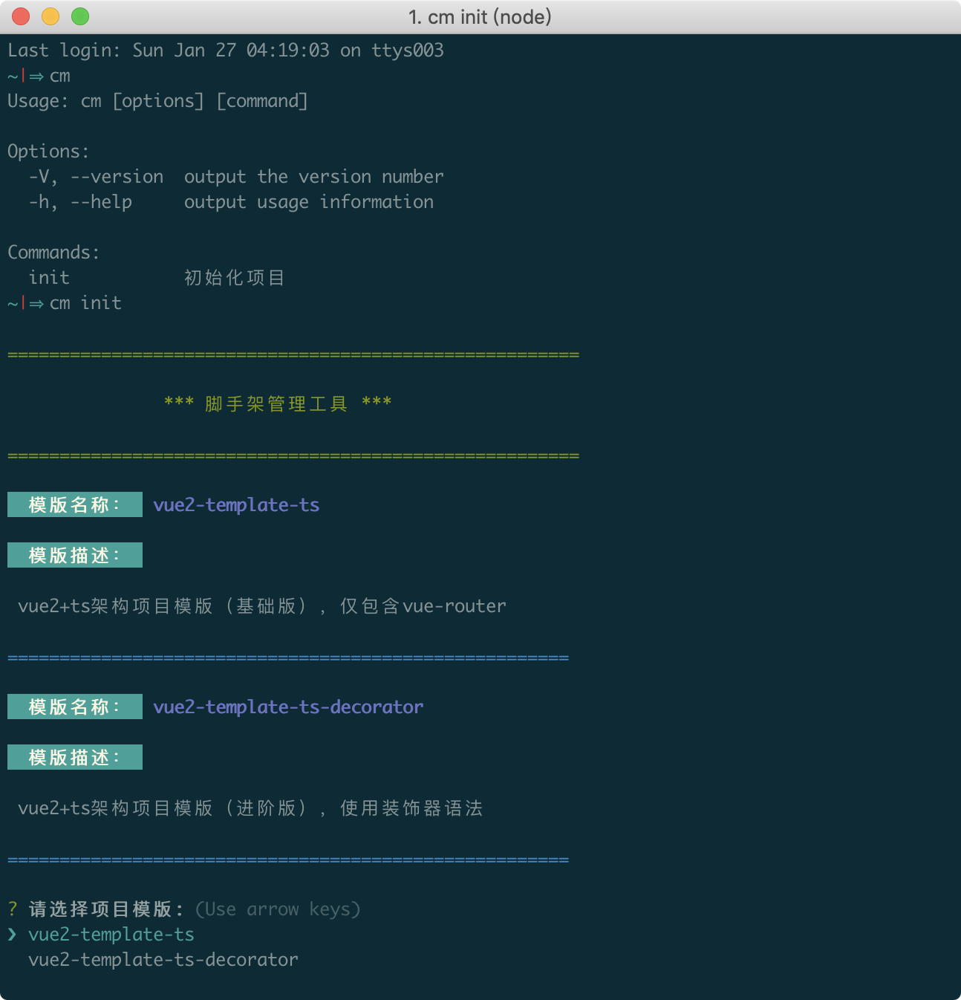
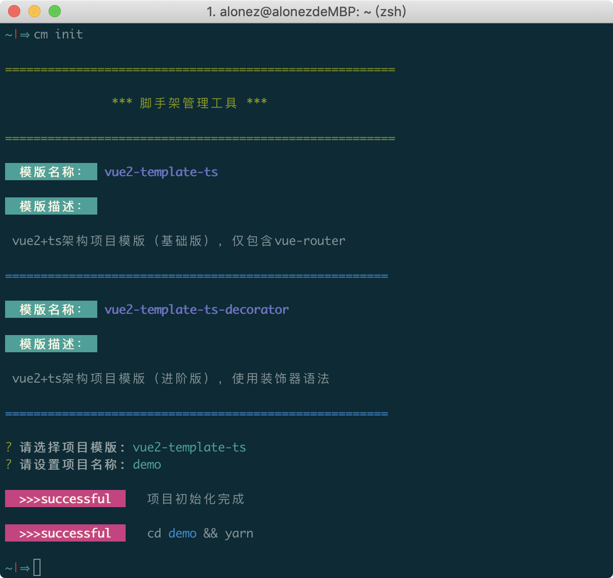

# cli-manage

一款脚手架管理工具，通过拉取github预设好的模版项目进行初始化

### 项目结构

``` ts

.
├── LICENSE
├── bin
│   └── cm.js                 // 配置全局命令
├── package-lock.json
├── package.json
├── readme.md
├── src
│   ├── cli
│   │   └── index.js          // 脚手架入口文件
│   ├── cmd
│   │   └── index.js          // 核心命令文件
│   └── config
│       └── templates.json    // 模版配置文件
└── yarn.lock

```

### 工具截图





### 使用步骤

#### 在package.json作如下配置：

``` bash
"bin": {
  "cm": "./bin/cm.js"
}
```

#### 本地调试的时候，在项目根目录下执行以下命令：

``` bash
npm link
```
这样做的目的是为了将cm命令注册到全局，以后直接使用cm即可。

看到如下提示即说明cm命令已注册到全局。

``` bash

/usr/local/bin/cm -> /usr/local/lib/node_modules/cli-manage/bin/cm.js
/usr/local/lib/node_modules/cli-manage -> /Users/alonez/Work/github/cli-manage
```
